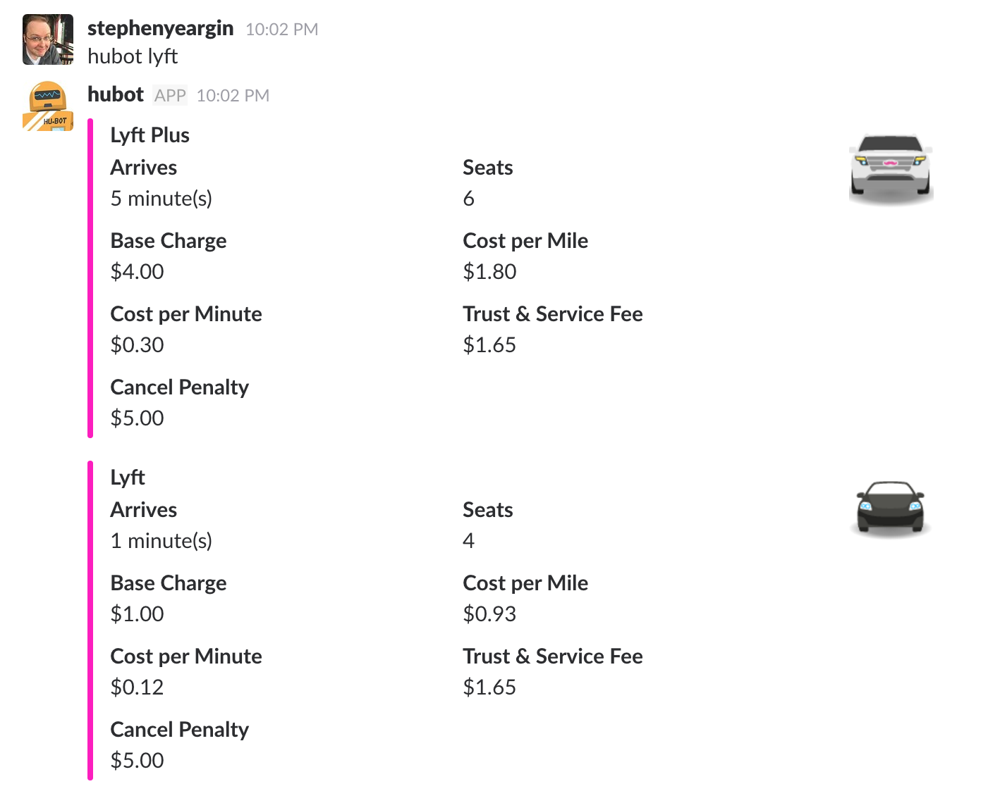

# Hubot Lyft

List estimated arrival times and available Lyft services.

## Installation

In hubot project repo, run:

`npm install hubot-lyft --save`

Then add **hubot-lyft** to your `external-scripts.json`:

```json
[
  "hubot-lyft"
]
```
### Configuration

Begin by [registering an application with Lyft](https://www.lyft.com/developers/manage). After you have created the app, click "Show Credentials" to grab the `Client Token` value. Save this in your configuration as `HUBOT_LYFT_CLIENT_TOKEN`.

| Environment Variable      | Required? | Description                          |
| ------------------------- | :-------: | ------------------------------------ |
| `HUBOT_LYFT_CLIENT_TOKEN` | **Yes**   | Client OAuth2 Token |
| `HUBOT_LYFT_DEFAULT_LATITUDE` | No`^` | Default latitude for your queries |
| `HUBOT_LYFT_DEFAULT_LONGITUDE` | No`^` | Default longitude for your queries |

`^` Will work without it, but defaults to downtown Nashville, TN. Not very useful for service where _you_ might be.

## Sample Interaction

### Slack



### IRC / Hipchat

```
user1> hubot lyft
Hubot> Lyft: Seats 4, arrives in 2 minute(s)
Hubot> Lyft Plus: Seats 6, arrives in 3 minute(s)

```

## NPM Module

https://www.npmjs.com/package/hubot-lyft

## Related

- [hubot-uber](https://github.com/maxbeatty/hubot-uber) - This one is a bit more full-featured in that it stores locations and gives cost estimates.
